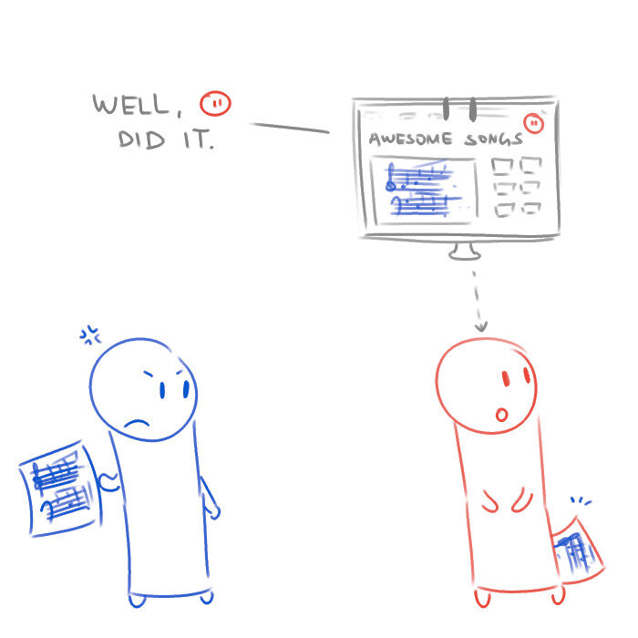
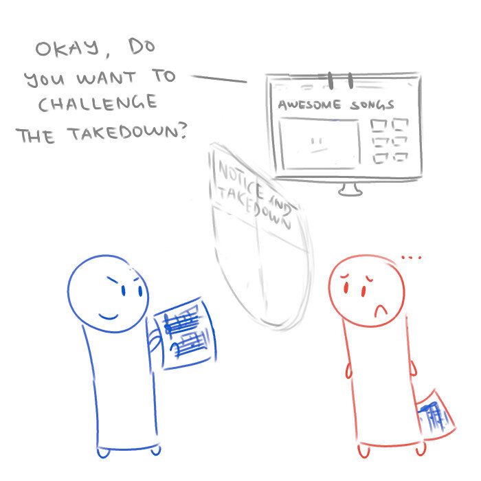

## Copyright Takedowns Explained
If you've ever seen YouTube videos getting removed or web search results getting omitted, this is probably what happened. Also known as the DMCA (Digital Millennium Copyright Act) "safe harbours".

Some technical things to note: In the comic below, the blue person tries to sue a website. You can't do that in real life—you need to sue the person behind the website. For example, you can't sue the YouTube website; you need to sue the company running the YouTube website, which is... well, YouTube Inc. That person/company is usually called something like a "network service provider" or "internet service provider", and asking them to take down your stuff is called a "takedown request".

  
  
  
  
  
  
  
  
  

--- 

**"What Is Law Even" Law Cartoons, by Darren Ang**  
Website : <https://www.whatislaweven.com/>

**Disclaimer:**  
None of the information provided on this website constitutes legal advice. If you wish to seek legal advice, please consult a lawyer.  
That is, if you're wondering what the law thinks about a situation you're in, you really shouldn't rely on what some random webpage says to make your decisions.  

**"Public Domain" License:**  
All content on this page, including its texts and comics, is under a [CC0 license](https://creativecommons.org/share-your-work/public-domain/cc0/). That is, I reserve no rights for any content that I make.   
You may use, share, change, or do anything with my content. You do not need to credit me or notify me.  
(Note that I include a "@whatislaweven" tag for most of my content. You are not obliged to keep that either.)   
