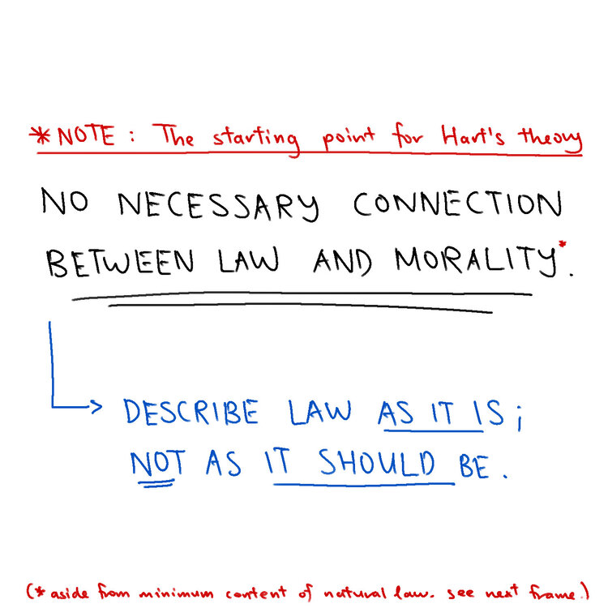

## The Hartian "Concept of Law"
A genuine guy, Professor H.L.A. Hart, wanted to answer the question of "what is law". Until now, I'm still not sure what it is (the name of this website gives it away). But I still think the Hartian theory is the cleanest one you'll get, so here are its basic ideas.

  
  
  
  
  

--- 

**"What Is Law Even" Law Cartoons, by Darren Ang**  
Website : <https://www.whatislaweven.com/>

**Disclaimer:**  
None of the information provided on this website constitutes legal advice. If you wish to seek legal advice, please consult a lawyer.  
That is, if you're wondering what the law thinks about a situation you're in, you really shouldn't rely on what some random webpage says to make your decisions.  

**"Public Domain" License:**  
All content on this page, including its texts and comics, is under a [CC0 license](https://creativecommons.org/share-your-work/public-domain/cc0/). That is, I reserve no rights for any content that I make.   
You may use, share, change, or do anything with my content. You do not need to credit me or notify me.  
(Note that I include a "@whatislaweven" tag for most of my content. You are not obliged to keep that either.)   
