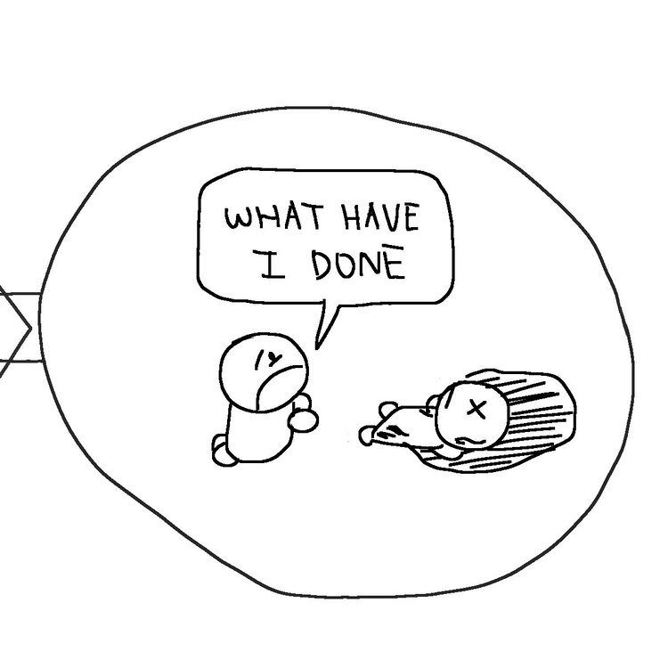

## Rashness and Negligence
From that classic case of Re Nidamarti Nagabhushanam (1872) 7 MHC 119.

The legalese:

"Culpable rashness is acting with the consciousness that the mischievous and illegal consequences may follow, but with the hope that they will not, and often with the belief that the actor has taken sufficient precaution to prevent their happening. The imputability arises from acting despite the consciousness (luxuria). Culpable negligence is acting without the consciousness that the illegal and mischievous effect will follow, but in circumstances which show that the actor has not exercised the caution incumbent upon him, and that if he had he would have had the consciousness. The imputability arises from the neglect of the civic duty of circumspection."

  
  
  
  
  
 

[rashness-negligence-full.jpg](rashness-negligence-full.jpg)

--- 

**"What Is Law Even" Law Cartoons, by Darren Ang**  
Website : <https://www.whatislaweven.com/>

**Disclaimer:**  
None of the information provided on this website constitutes legal advice. If you wish to seek legal advice, please consult a lawyer.  
That is, if you're wondering what the law thinks about a situation you're in, you really shouldn't rely on what some random webpage says to make your decisions.  

**"Public Domain" License:**  
All content on this page, including its texts and comics, is under a [CC0 license](https://creativecommons.org/share-your-work/public-domain/cc0/). That is, I reserve no rights for any content that I make.   
You may use, share, change, or do anything with my content. You do not need to credit me or notify me.  
(Note that I include a "@whatislaweven" tag for most of my content. You are not obliged to keep that either.)   
