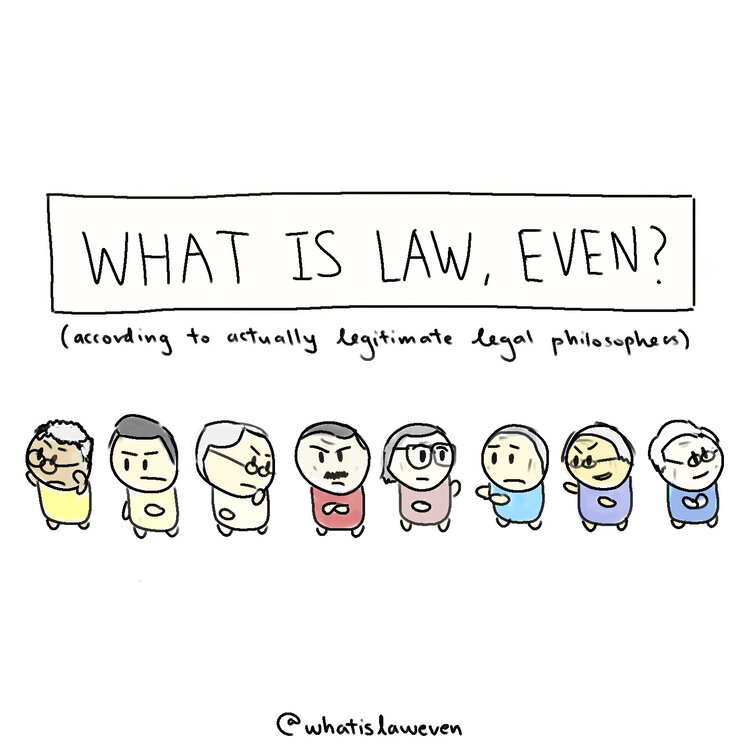
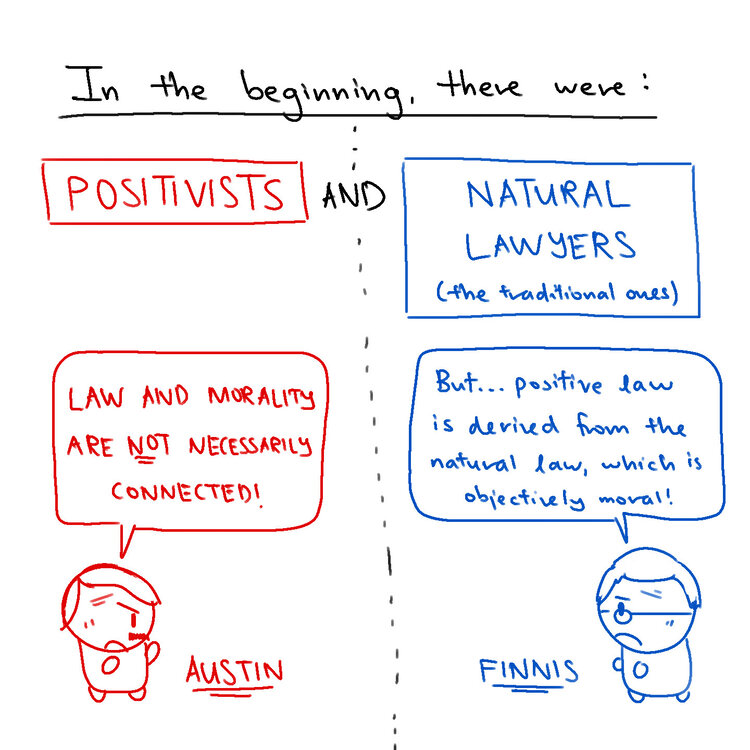
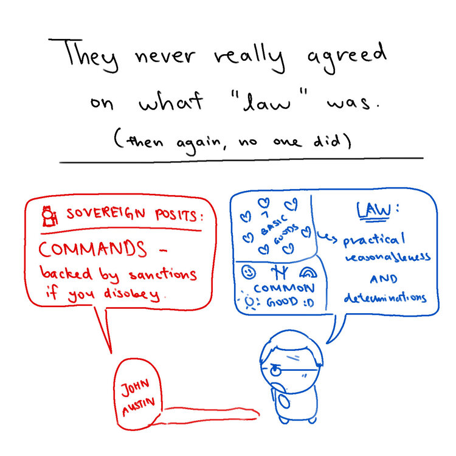
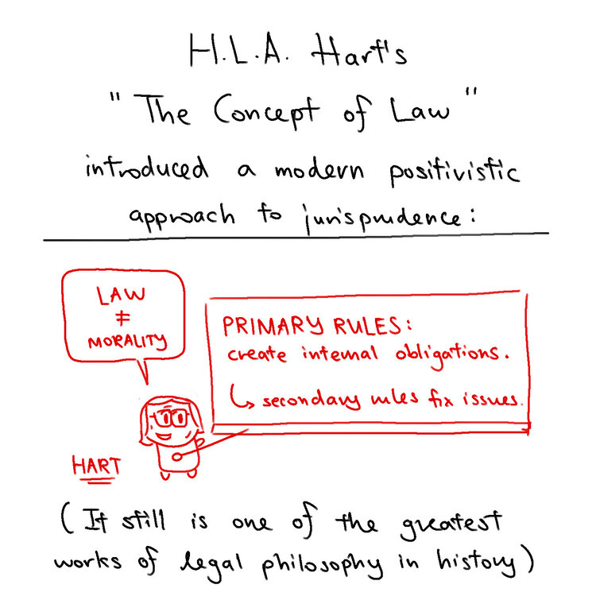
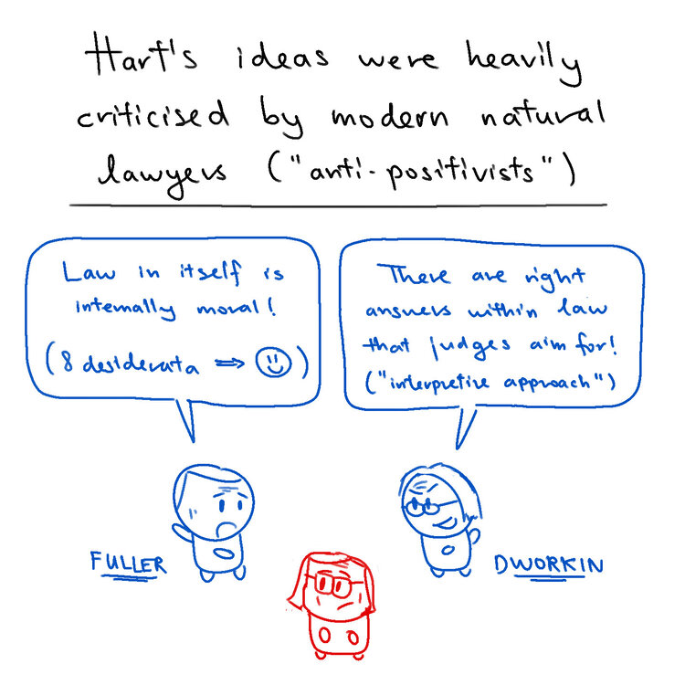
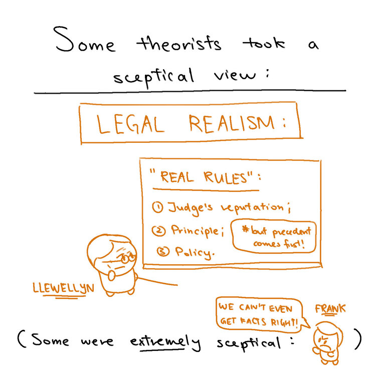
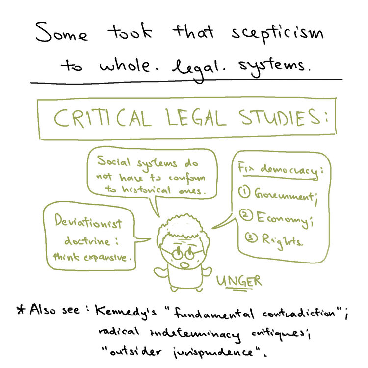
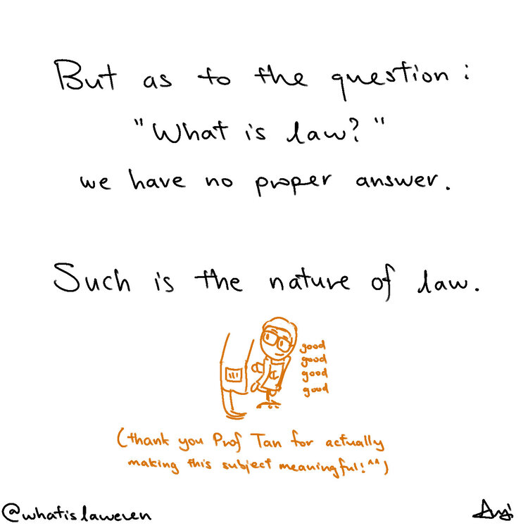

## "What Is Law Even": Answering the Question!
When I set up this account, I was genuinely curious about this question. After reading some legal theory, I realise that I'm not alone, and also that I'm incredibly confused. I still am.

(Much thanks to Prof Tan Zhong Xing from the National University of Singapore, Faculty of Law, for teaching me! He features in the last panel of this comic.)

  
  
  
  
  
  
  
  

--- 

**"What Is Law Even" Law Cartoons, by Darren Ang**  
Website : <https://www.whatislaweven.com/>

**Disclaimer:**  
None of the information provided on this website constitutes legal advice. If you wish to seek legal advice, please consult a lawyer.  
That is, if you're wondering what the law thinks about a situation you're in, you really shouldn't rely on what some random webpage says to make your decisions.  

**"Public Domain" License:**  
All content on this page, including its texts and comics, is under a [CC0 license](https://creativecommons.org/share-your-work/public-domain/cc0/). That is, I reserve no rights for any content that I make.   
You may use, share, change, or do anything with my content. You do not need to credit me or notify me.  
(Note that I include a "@whatislaweven" tag for most of my content. You are not obliged to keep that either.)   
