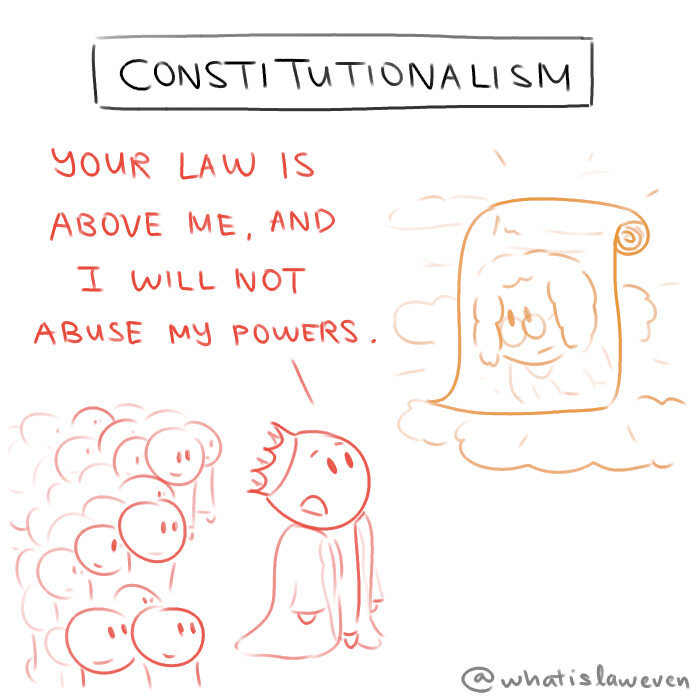

I recall my first public law class very fondly, because of this word. It kept appearing in the slides and the readings, but I had no idea what it meant. I did some online searches for it, but Wikipedia and other sites gave no clean definition. But in class, when the tutor asked, "What is **constitutionalism**?", I took a random stab at the answer, "Limiting government power." I was surprised when the tutor said that I was right, and this turned into the simple definition we went back to for the whole class. 

But with some hindsight, I realise why the word accords no simple definition. Even the simple definition I gave wasn't entirely accurate, because it assumes that government power will be limited. This is not always the case, yet for some reason governments face limits? It's confusing. But hey, hope the simple definition works for you.

--- 

**"What Is Law Even" Law Cartoons, by Darren Ang**  
Website : <https://www.whatislaweven.com/>

**Disclaimer:**  
None of the information provided on this website constitutes legal advice. If you wish to seek legal advice, please consult a lawyer.  
That is, if you're wondering what the law thinks about a situation you're in, you really shouldn't rely on what some random webpage says to make your decisions.  

**"Public Domain" License:**  
All content on this page, including its texts and comics, is under a [CC0 license](https://creativecommons.org/share-your-work/public-domain/cc0/). That is, I reserve no rights for any content that I make.   
You may use, share, change, or do anything with my content. You do not need to credit me or notify me.  
(Note that I include a "@whatislaweven" tag for most of my content. You are not obliged to keep that either.)   
