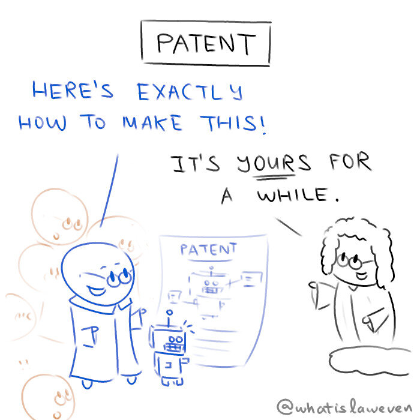

**Patents** deal with inventions. It can take years of effort and loads of money just to invent something, so by the time your invention works, you're stuck in a pretty weird spot. On one hand, you could keep your methods secret and market your invention to the world, but other people could reverse-engineer it and compete with you. On the other, you could tell the entire world how to re-create your invention (that's what a patent is), but in return you'll get a monopoly over it for some time. That's pretty much what goes in an inventor's head when deciding whether or not to patent something.

--- 

**"What Is Law Even" Law Cartoons, by Darren Ang**  
Website : <https://www.whatislaweven.com/>

**Disclaimer:**  
None of the information provided on this website constitutes legal advice. If you wish to seek legal advice, please consult a lawyer.  
That is, if you're wondering what the law thinks about a situation you're in, you really shouldn't rely on what some random webpage says to make your decisions.  

**"Public Domain" License:**  
All content on this page, including its texts and comics, is under a [CC0 license](https://creativecommons.org/share-your-work/public-domain/cc0/). That is, I reserve no rights for any content that I make.   
You may use, share, change, or do anything with my content. You do not need to credit me or notify me.  
(Note that I include a "@whatislaweven" tag for most of my content. You are not obliged to keep that either.)   
